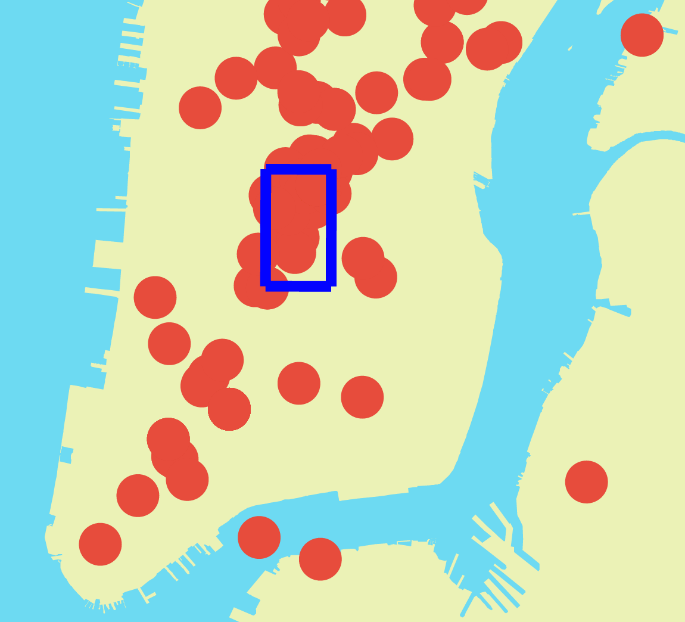

### Realtime Discovery of Latent Trends in Tweets

#### Aaron Behr (abehr)   —   Alex Hadik (ahadik)

What is Newsflash?
------------------
Newsflash is an analytics tool to discover stories as they emerge in realtime by monitoring Tweets from around the world. Newsflash uses natural language processing and geographic data to recognize clusters of content. To read more about the background and motivation of Newsflash, check out the [About document](/about.md).

Contributing to Newsflash
-------------------------
Interested in contributing to Newsflash? Feel free to fork this repository and follow the guidelines found in the [Contributing document](/contributing.md). 

We use ZenHub to track and manage issues, which you can [install as a Chrome Plugin](https://www.zenhub.io/) for free since this is an open source project. Check out the open issues, and by all means, help us tackle it with a Pull Request. Again, refer to the [Contributing doc](/contributing.md) for info on how to do that.

Using Newsflash
---------------

We are in the process of preparing Newsflash to run live on the web.
Currently, it can be run locally, with a limited set of options
available.

Before running Newsflash, ensure that the Python web development
packages [Flask](http://flask.pocoo.org/) and
[Tornado](http://www.tornadoweb.org/en/stable/) are installed and
updated. Both can be set up with `pip`.

To run Newsflash, begin by instantiating an instance of the server:

    python code/server.py

Then, the Newsflash application can be started. We recommend the
following set of arguments:

    python code/app.py -t data/tweets_nyc_apr26-30.csv -m -i 1000

Finally, navigate in your web browser to `localhost:5000/bound`.
Initially, you will see a progress bar indicating that Newsflash is
training its model using the provided file. This will fade upon
completion, enabling interactivity; meanwhile, Newsflash will begin
streaming live tweets.

From the Tweet Statistics bar, you can select a trending term to display
the geographic distribution of the tweets for the term as well as the
calculated bounding box. Also available is the total frequency and
change in frequency, or acceleration, of the term. **One bug to note:**
After selecting a term for display, the interface will not refresh until
you zoom or move the map slightly. We are working on fixing this, but
were unable to do so by this deadline.

The Newsflash app is set up such that the user can specify one of two
preset Tweet collection regions (greater Manhattan area; continental US)
or the coordinates for a custom region. We have experimented with
multiple maps and Tweet collection regions. However, current limitations
on data collection and computation prevent us from being able to offer
custom Tweet collection regions. We provide the file
`tweets_nyc_apr26-30.csv`, which contains Twitter data from the greater
Manhattan area for a period of four days, from 4/26 through 4/30;
therefore, please use the bounding box flag `-m` in order to live-stream
tweets from the same area. For a full list of options, enter:

    python code/app.py -h

Ideally, we’d have constantly updating databases, so that when you start
streaming there’s no time gap between the last tweet in the training
file and the first streaming tweet. Currently, this is not feasible. The
other consequence of this is: the initial rank calculation obviously
only takes tweets from the file into account. For subsequent term rank
calculations, the *acceleration* metric is incorrect because the only
tweets in the last 24 hours are the 50 or so that have just been
collected in the time that the app has been running. Therefore, we
recommend setting `-i 1000` or some relatively large number, such that
the rankings are not recalculated while you explore the app. This means
that, while new tweets will be streamed and added to the Newsflash data
structures, the term rankings will not actually be updated live.
Instead, they will give an accurate picture of what things looked like
between April 26–30. Unfortunately, due to the scale of this project, we
are unable to have a truly live, time-consistent database. Still, we
have shown a proof of concept, and the code base is perfectly ready to
support such a database had we the resources to implement one.

The Newsflash Paradigm
----------------------

In the original conception of this project, we were back and forth on
whether or not the content should be populated in real time or by
loading a file containing pre-streamed Tweet data. In addition to making
testing easier, working from files means that large quantities of tweets
can be kept in advance, providing much more data to work with than a
live feed (in particular with respect to time). Still, it is both
informative and viscerally satisfying to analyze how new data coming in
live affects the trends.

Therefore, we devised a solution that takes advantage of both sides. We
developed a script to stream live tweets, constrained by language and
location, to file. While the Newsflash web application provides the user
with choices, the default behavior is to populate its data structures
with existing Tweet data and then continue to update its model with a
live stream.

To maintain term frequency baselines that are as “current” as possible,
Tweets older than a specified age are discarded; our current operating
window when looking exclusively at the Manhattan area is seven days. Of
course, this measure also serves to prevent the usage of too much disk
space.

Given the massive amount of data necessary to make powerful insight, we
spent a great deal of time on optimization. We implemented several
paradigms for the Newsflash data structures and chose the most
space-efficient, finding that a lean object-oriented representation was
about 25% more space-efficient than an array representation, and about
75% more space-efficient than a hash map representation. We also
rigorously time-optimized each step of the process of parsing and
tokenizing Tweets, decreasing runtime by 40% from our initial
implementation.

Ultimately, our algorithm can process about 5,000 tweets per second,
using less than 3kb to store all necessary information.

#### Entropic bounding box calculation

Topics trend in time and in space. We developed an algorithm to test for
a clustered versus distributed distribution of Tweets relating to a
term. Given the computational expense of most clustering algorithms, it
would not be feasible to perform such analyses on thousands of terms,
each of which may be linked to tens or hundreds of Tweets. We derived a
simple, greedy algorithm that calculates a bounding box for a given term
which captures a maximally dense area of Tweets relating to the term,
derived from the concept of entropic decision trees. In principle, the
algorithm repeatedly makes latitudinal and longitudinal cuts to the
bounding box until further subdivisions would no longer result in a
significant decrease in entropy. We provide simplified pseudocode below:

    def trending_location(term):
        points = [tweets[tweetID].location for tweetID in terms[term].tweets]
        i = 1 # splitting on latitude or longitude
        end = False # flag for system to avoid spurious premature ending

        # initial bounding box = continental US.
        # e.g. south = the southernmost latitude in the continental US
        box = [ [south, north], [west, east] ]

        while area(box) > threshold:
            midpoint = box[i][0] + (box[i][1] - box[i][0]) / 2

            less = []
            greater = []

            for point in points:
                if point[i] < midpoint:
                    less.append(point)
                else:
                    greater.append(point)

            if less has many more points than greater:
                end = False
                box[i][0] = midpoint
                i = (1 if i==0 else 0)
                points = greater

            else if greater has many more points than less:
                end = False
                box[i][1] = midpoint
                i = (1 if i==0 else 0)
                points = less

            else:
                if not end:
                    end = True
                    i = (1 if i==0 else 0)
                else:
                    break

        return box

Thus, terms trending in a specific state (or city) will have small (or
smaller) bounding boxes, whereas terms trending across the US will have
enormous ones. Interestingly, with sufficient Tweet density, this
algorithm gives an extremely high resolution. For example, given a large
sample of Tweets from the greater Manhattan area, bounding boxes for
‘brooklyn’, ‘union squar’ (stemmed bigram), and the ‘park’ recapitulate
the locations referred to by those terms because of the frequency with
which users tweet about their current location and activities.

#### Trending terms and *acceleration*

The signature of an important news story is a surge of data related to
the story. We developed a term-wise metric, termed *acceleration*, which
computes the recent-to-total term frequency ratio. For a given term, the
rate of relevant Tweets accumulated over the last 24 hours is compared
to the background rate.

Still, absolute term frequency, bounding box area, and term density all
provide valuable information. We sampled a variety of multifeatured
vectors by which to weigh terms, and subjectively determined an optimal
configuration. We chose not to include any location-related metrics in
this calculation; calculated entropic density and other location-based
metrics help determine the distribution or source of a term’s
significance signal, but simply the fact that a term is significant
should be agnostic with respect to location.

#### Front-End Interface

The algorithms of Newsflash are of little practical use without a front
end interface to allow viewing and analysis by a user. Thus, a large
portion of our work focused on providing a useful interface for the
user.

Initially, the front end of Newsflash was a tool for use ourselves. We
needed to see how our data was grouped geographically, temporally, and
by content. We started with a basic map of New York City using D3. We
sourced the map from a collection of municipal maps available from the
New York City local government.

With this basic map as our front end template, we began to build out the
server side of Newsflash.

Newsflash Server
----------------

The static Newsflash interface is served by a simple HTTP server with
details and data communicated over a multithreaded Flask based websocket
server making use of the Tornado websockets library. The server is
multithreaded to allow new client connections to be detected and handled
while the Newsflash model is trained and evaluated in parallel.

Initially, we made use of the websocket server to replay files of Tweets
collected from the Twitter firehose. We used these streams to visualize
our data and understand how to best tweak the Newsflash model to glean
the most information from our collected Twitter data.

We we gathered a better understanding of our dataset, we reworked our
server to provide more useful analytical data. In the final iteration of
the Newsflash server, data is continuously extracted from the Newsflash
model, such as the live Twitter feed or trending terms, as is
transmitted immediately to all connected clients. This enables a far
more interactive user experience as new data can be presented as it
becomes available.

Newsflash Front End
-------------------

As we refined our algorithms and server, the Newsflash interface evolved
as well. In the final iteration of the Newsflash interface, the
following events are communicated between client and server:

-   Server status
    -   If the server is currently busy training the model, clients can
        connect but are displayed a loading screen.
    -   On the loading screen, the percent complete of model training is
        displayed for the user.
-   Live Tweets
    -   As Tweets are collected over the API, their location is passed
        along to the client for visualization on the map.
-   Analytics
    -   The model’s ranked terms and associated weights are passed to
        clients for display. As the model is retrained, updated rankings
        are passed.
-   Tweet content
    -   Any Tweet displayed in the browser has its Tweet ID associated
        with it in memory. Using this ID, the content of the Tweet can
        be retrieved and displayed on request over websockets.

Results
-------

Testing Newsflash was to some degree a subjective process as we had to
determine which topics Newsflash marked as trended corresponded to real
events. Newsflash delivers the top 30 ranked terms amongst which we
found many promising terms corresponding to emerging stories within the
city. However, we faced two key challenges in producing meaningful
rankings:

#### Data

Our data set was thorough, however the timing skewed our results. We
terminated data collection at midnight Thursday April 30th. Newsflash is
designed to be trained on an input data set which it then augments with
live Tweets. In a production environment, this training dataset would
run up until moments before training. This ensures that the Newsflash
model is trained on data that is contextually relevant to the time and
date that the model starts to collect live Tweets. However, since we
only had a single data set that was many days outdated by the time we
got to testing our model, we couldn’t test our model on the most
recently occurring events. Instead we had to look back the events of the
week of April 27th in NYC. It also meant that we couldn’t see how well
the model generalized across many different datasets. This would have
been useful analysis.

#### Volume vs. *acceleration*

Many terms rise to the top due solely to their sheer frequency. For
instance, “New York” and similar terms are incredibly common in NYC and
thus it’s very difficult to weight these terms down. We don’t want to
ignore terms of high frequency entirely, but we do want to avoid
reporting obvious terms like “New”, “York”, “Madison”, etc.

#### Successes

Our largest dataset does raise some very pertinent terms to the top such
as “protest”. On April 29th a protest for the Freddie Gray case in
Baltimore took place in Union Square. Not only did the Newsflash model
detect the sharp increase in this topic’s popularity, it also found a
very tight bound to the location of the protest in Union Square.
Plotting the change in frequency, or *acceleration* of the term’s
frequency, we can very clearly see the increase corresponding to the
protest.

Amongst other smaller data sets we used for testing we found similar
successes, such as the Mayweather/Pacquiao fight which was widely
discussed. However, the lack of a geographic center for this trend made
it a less useful term to report as trending. Overall, we found that our
model does pick up on true positives well, but overwhelmingly still
reports false positives. Further research and parameter tuning is
necessary to reduce the false positive rate of Newsflash.

Future Directions
-----------------

We are excited to continue development of Newsflash beyond the scope of
this course. Currently, we are primarily focused on:

1.  Improving entropic bounding box calculations
2.  Improving resolution of the *acceleration* metric
3.  Regulate/standardize resizing of Tweet dots, especially in the case
    of overlapping tweets (they should be zoomed or shuffled on mouse
    hover so that all overlapping Tweets can be viewed/accessed)
4.  Adding options in the UI so that the user can dynamically change the
    information provided a. Specify the resolution and relative weight
    of the *acceleration* metric b. Search for terms c. Remove terms
    from the term rank list. For example, things like ‘new‘, ‘york’, and
    ‘manhattan’, are always considered significant in the greater
    Manhattan area due to sheer frequency, but are essentially stopwords
    in this context.

