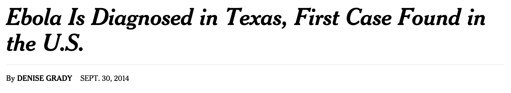

#The Origin of Newsflash

*Note:* Newsflash was originally developed in a data science course at Brown University.

Motivation
----------

News media has always been a race for first to publication. In the past,
publishers had hours or days to track down stories and their sources,
check facts, produce written content and go to print. In modern news
media, that window for success has shrunk to minutes if not seconds.
More so than ever, readers have little loyalty to their source, moving
wherever the story first emerges. If the Washington Post gets a push
notification out to mobile even a minute before the New York Times, the
Times has lost the first mover’s advantage; a serious blow to
viewership. As the New York Times editor for newsroom strategy says,
“Anytime we push our news directly to a user’s mobile, we see clicks and
swipes skyrocket”. And in breaking news you come in either first or
last.

This rapid ­paced publishing environment presents several challenges.
The first and most crucial hurdle is story discovery. Newsrooms sit in
the dark, waiting for a lead to come their way. They employ manpower to
find stories, scouring Tweets, Facebook posts, police scanners and other
information vectors by hand. The publisher that gets lucky gets the
scoop. With readers pawing at their lockscreens for whichever push
notification pops up first, seconds can make a difference.

The breaking news of the first Ebola diagnosis in the US is a fantastic
example of the widening gap between the pace of publication, and the
sourcing of news. In this case, a local news station got notice of the
Ebola diagnosis first, and Tweeted out the scoop.

Whichever national publication happened to be following and watching
this local Houston news station on Twitter would now get the scoop
first. In this case, it wasn’t the New York Times or Washington Post but
a small startup newsagency. They pushed their story to mobile phones
minutes before anyone else, bringing them a substantial advantage in
readership. It took hours for the New York Times to break the same
story.

The pressure to write and publish as fast as journalists can source and
synthesize often pushes the focus on fact checking to the second tier.
The fallback is to publish as little as necessary at first, to get first
mover’s advantage, and then supplement with more robust material when
facts come to light. This leaves a lot to be desired in the context of
the typical high quality reporting of publishers like the Times or the
Post.

Finally, with a story sourced and written, a value must be placed on the
story. Does it get pushed to the homepage of the website? Of the app?
Does it warrant a push notification? These seemingly small decisions can
make all the difference in the success of a story. Bother a user with a
useless notification, and you cause annoyance, and in the worst case, a
lost subscriber. At the very least, the sorting of stories is an
indicator to readers of the priorities of the publisher.

The advantages of automating this complex process promises not only
faster response time for publishers, but also higher quality, better
curated material for readers. In the interest of automatization, we
developed Newsflash, a social media analytics platform that identifies
the content and location of stories as they emerge in real time.

Goals and Outcomes
------------------

Newsflash began as a success predictor for stories. That is, once a
publication had a story written, they could use our platform to predict
how successful the story would be based on the topic. However, our
initial research revealed a greater need amongst publishers was
identifying stories in the first place so our focus shifted to a
platform that combined geolocation and more robust trend detection.

Our first focus was detecting trends in the content of Tweets, and more
importantly, trends that are spiking sharply. From our original tests,
we found very promising results. Newsflash uses an inverted index of
terms and Tweets for fast calculation of baseline frequency as well as
rapid changes in frequency. This inverted index is the core of the
Newsflash *acceleration* algorithm which calculates recent change in
frequency of Tweets.

The top trending topics according to Newsflash’s *acceleration*
algorithm are clustered geographically using our iterative bounding box
approach. This turned out to be an important but secondary metric in
terms of offering meaningful analysis. Geographic clustering was less an
indicator of stories in and of themselves than a metric that helped
weight how likely a trending term was to represent a story.

Both detection of trending topics and identification of geographic
clustering behind terms were successful endeavors in Newsflash.
Considering our originally anticipated challenges of merely being able
to obtain the necessary data and do simple geographic clustering, we are
very happy with Newsflash’s progress to date. Our algorithms not only
detect trending topics in real time but augment analysis of those terms
with a sense of geographic clustering.

Furthermore, this tool is not helpful in any way without an associated
user interface, which Newsflash offers as well. Using our application, a
user can see trending terms in real time as they adjust to trends.
Selecting a term for further analysis displays the geographic clustering
of the term as well as the ability to see the content of the Tweets that
contributed to the trending topic of interest.

Data Collection To begin developing the algorithmic backbone of
Newsflash, we needed to set of training data. We took advantage of
Twitter’s Firehose API and the ability to receive only Tweets that were
geotagged and fell within a geographic bounding box. For 8 days, we
streamed the Firehose with a bounding box surrounding New York City. The
Twitter. The goal was to stream long enough to cover significant events
happening in New York City that our algorithm could detect. Success of
Newsflash would be based on its ability to sort these specific events
out from the noise. One week of data collection yielded a corpus of
500,000 geotagged Tweets with a collective size of about 100 MB. If this
data set proved to be statistically sufficient for real-time analysis,
we had a benchmark on the rate of Tweets to be analyzed, and the amount
memory/disk space those Tweets would require.